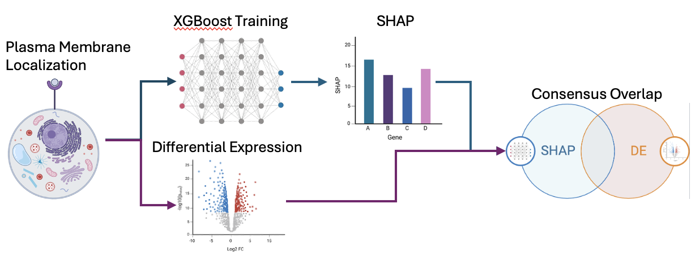

# IsoMarker


## Main
IsoMarker is a Python3 software package designed to identify gene expression markers using the consensus overlap of Differential Expression (PyDESeq2), AUC (WilcoxAUC), and machine learning explainability (SHAP) approaches.

IsoMarker was originally designed for the task of identifying cell surface markers for specific leukemic blast cell states useful for acute leukemia diagnostic subtyping by flow cytometry.

## Description
Identifying gene expression markers of cell states is classically computed using differential expression approaches of transcriptomic data. However, differential expression often leads to large gene lists (>100s of genes) that may be redundant and introduce noise when collectively used to identify specific cell states.

To address the problem of nominating highly specific, predictive, and minimal cell state marker gene lists, IsoMarker aims to identify differentially expressed, specific, and predictive gene lists for specific cell states using a consensus overlap approach across multiple well-used methods of marker nomination. Beyond cell state marker identification, IsoMarker can be broadly applied to tasks where nomination of specific, minimal markers from high dimensional data is required. The rich selection of built-in analytical and visualization functions and simple, one-line summary function makes IsoMarker a simple, easy-to-use, and end-to-end tool for marker identification.

## Installation
```sh
pip install isomarker
```

## Tutorial
Tutorial is provided in ./tutorial/Tutorial.ipynb with a sample dataset. All analytical and visualization functions in IsoMarker are described and used in the tutorial.

## File Structure
<pre>
├── LICENSE       
├── README.md
├── isomarker.py                                                
├── setup.py
├── tutorial
│   └── Tutorial.ipynb             # Tutorial Notebook
│   └── Sample_Metadata.csv        # Example Metadata CSV
│   └── Sample_Raw_Count.csv       # Example Pseudo-bulk Sample X Feature Raw Count CSV
│   └── Sample_VSTNorm_Count.csv   # Example Pseudo-bulk Sample X Feature VST-normalized Count CSV
│   └── Sample_Output.pickle       # Example IsoMarker Output
</pre>

## Contributing
Pull requests are welcome. For major changes, please open an issue first to discuss what you would like to change. Please make sure to update tests as appropriate.

## Reference
Coming soon...
